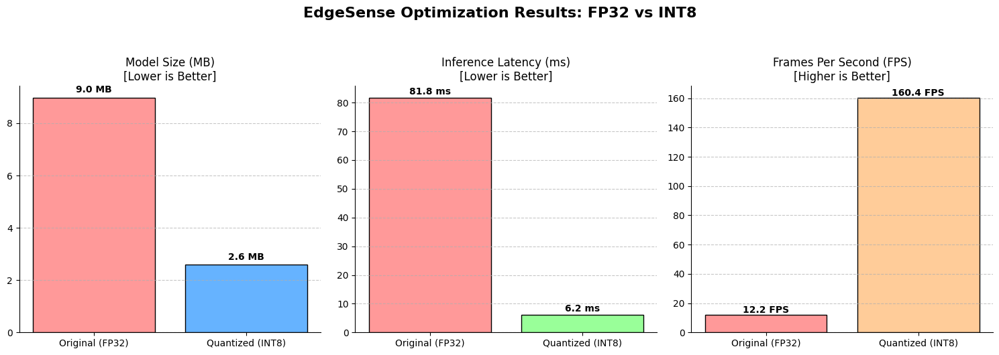

# EdgeSense: Real-Time Edge AI Optimization Pipeline 

##  The Engineering Challenge
While Deep Learning models achieve state-of-the-art accuracy, they are often too heavy, memory-intensive, and power-hungry to run locally on standard edge devices (like IoT sensors, mobile phones, or embedded systems). 

**EdgeSense** is an end-to-end Machine Learning optimization pipeline designed to solve this exact problem. It demonstrates the complete lifecycle of adapting a vision model into a highly efficient, production-ready system capable of real-time inference on resource-constrained hardware, using Driver Drowsiness Detection as a practical use case.

##  Key Features & System Architecture
* **Custom Transfer Learning:** Fine-tuned the top layers of a pre-trained MobileNetV2 architecture to detect specific visual states (Open eyes, Closed eyes, Yawning).
* **INT8 Post-Training Quantization:** Engineered the model conversion from Float32 to INT8 using a representative dataset to calibrate activation ranges. This drastically reduces the memory footprint and CPU overhead while maintaining robust accuracy.
* **Automated Benchmarking Suite:** Developed a built-in performance evaluation script that precisely measures Inference Latency, Model Size (MB), and Frames Per Second (FPS) to quantify the ROI of the optimization.

##  Optimization Results (FP32 vs. INT8)

Based on the benchmarking tests, the quantization process yielded massive performance gains:

| Metric | Original Model (FP32) | Quantized Model (INT8) | Improvement |
| :--- | :--- | :--- | :--- |
| **Model Size** | 9.0 MB | 2.6 MB | **~71% Reduction** |
| **Latency / Frame** | 81.8 ms | 6.2 ms | **~92% Reduction** |
| **Speed (FPS)** | 12.2 FPS | 160.4 FPS | **13x Faster** |

##  Tech Stack
* **Languages & Frameworks:** Python, TensorFlow, Keras, TensorFlow Lite.
* **Data Processing & Visualization:** NumPy, Matplotlib.
* **Concepts Demonstrated:** Edge AI, Model Compression, Latency Reduction, Hardware Optimization.
